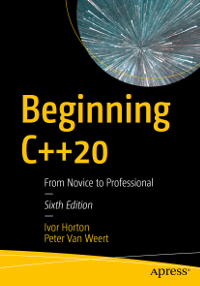

# Apress Source Code

This repository accompanies [*Beginning C++20*](https://www.apress.com/9781484258835) by Ivor Horton and Peter Van Weert (Apress, 2020).

[comment]: #cover

Download the files as a zip using the green button, or clone the repository to your machine using Git. 
To make sure you also clone the 3rd party submodules in the [Workarounds](Workarounds) directory, 
we recommend using the following Git command:

    git clone --recursive https://github.com/Apress/beginning-cpp20.git

## Contributions

See the file [Contributing.md](Contributing.md) for more information on how you can contribute to this repository.
