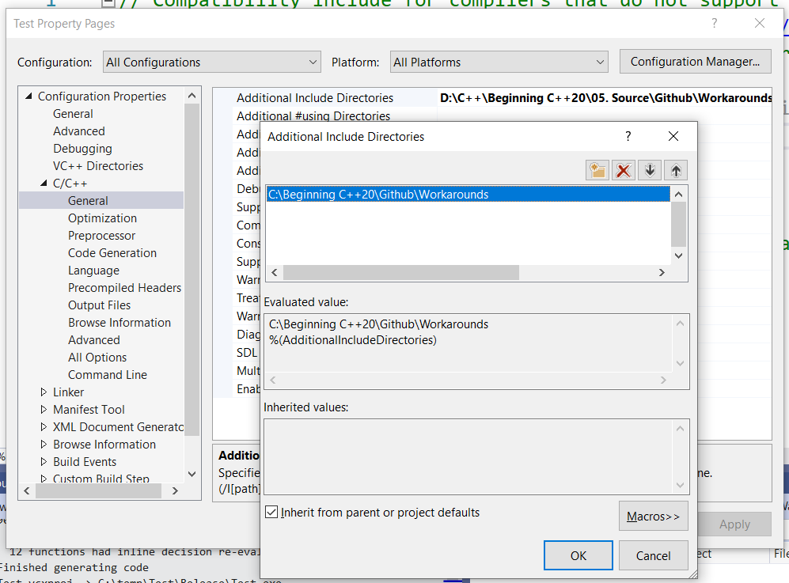

# Workarounds

At the time the book was completed, 
not a single compiler [supported](https://en.cppreference.com/w/cpp/compiler_support) all C++20 features yet. 
Features that were used in the book, 
and for which you therefore need a workaround to compile and run the example / exercise code include

- [Modules](#modules)
- [std::format()](#format)  
- [Abbreviated Function Template Syntax](#abbreviated)  
- [Ranges](#ranges)  

<a name="modules"/>

## Modules

Most source code, most notably that in the second half of the book, uses C++20's modules.
Unfortunately, [support](https://en.cppreference.com/w/cpp/compiler_support) for this feature may still be lacking in your compiler / build system.
For the smaller examples it is just a matter of replacing the `import` declarations with `#include` directives 
(see [Appendix A](../Appendix.pdf)), but for examples comprising multiple files working around these limitations can be more work.
For all examples and exercises that are not explicitly about modules,
we therefore made an equivalent version available that does not use modules.
You can find these in the `NoModules` directories of this source repository.

<a name="format"/>

## std::format()
As of today, no compiler [supports](https://en.cppreference.com/w/cpp/compiler_support) the C++20 `<format>` module yet. 
This module provides safe, elegant, and efficient text formatting, primeraly in the form of the `std::format()` function,
and is heavily used throughout the C++20 edition of the book.

As a workaround, we recommend the [`{fmt}`](https://fmt.dev/) library, 
a free and open source implementation of a superset of the now standardised `<format>` module.

Steps:
1. Download the `fmt` source code 
   - If you downloaded the book's source code as a zip file, you can download that of `fmt` as well from https://github.com/fmtlib/fmt, 
     and extract it in a `fmt` subdirectory of this `Workarounds` directory
   - If you cloned using Git, but without specifying `--recursive`, 
     you can execute the following Git commands in the root directory of your local clone:
   
         git submodule init
         git submodule update
 
 2. Add the `Workarounds` directory to the additional include paths of your compiler
    - For clang and gcc, you do this using the `-I` / `--include-directory` command line flags
    - For Visual Studio, you right-click your project, select Properties,
      and add the `Workarounds` directory under 
      
          Configuration Properties ► C/C++ ► General ► Additional Include Directories ► Edit...
          
      as illustrated in the following image
      
      
      
 3. If all went well, `#include <format>` will then use the [`format`](format) header in this directory,
    which injects `{fmt}`'s functionality into the `std` namespace (technically not allowed, we know...), 
    and all `std::format()` statements will work as expected.

Note: this workaround works for `#include <format>` directives (see [Appendix A](../Appendix.pdf)); 
but we have not had much luck getting this to work with C++20's `import` declarations.
Until further notice, we therefore recommend you mostly use the `NoModules` versions of the source code.
If you do want to experiment with modules, and `std::format()` is getting in the way of that,
you can, for instance, add the following to your source files

    namespace std
    {
        export std::string format(auto&&...) { return {}; }
    }
    
Your formatted output will not work, 
but then at least you can try your luck getting the remainder of your modules to compile.

<a name="abbreviated"/>

## Abbreviated Function Template Syntax

If your compiler does not [support](https://en.cppreference.com/w/cpp/compiler_support) 
C++20's abbreviated function template syntax yet, the solution is somewhat obvious: 
use the non-abbreviated syntax. That is, instead of

    namespace math
    {
       auto square(const auto& x) { return x * x; }
    }
    
you use

    namespace math
    {
       template <typename T>
       auto square(const T& x) { return x * x; }
    }
    
(`auto` return type deduction should work with any recent compiler.)

<a name="ranges"/>

## Ranges

At the time of writing, 
not all Standard Library implementations [support](https://en.cppreference.com/w/cpp/compiler_support) C++20 ranges yet 
(and if they do, not all range algorithms are working as they should).
As a workaround, you can try the excellent [range-v3](https://github.com/ericniebler/range-v3) library of Eric Niebler.
We added the [header file](ranges) we used for this to this directory.
The steps you need to get this to work are similar to those we detailed for [`std::format()`](#format),
except that library needs to be compiled as well,
and the corresponding binaries added as input to your linker.
You can consult the [range-v3](https://github.com/ericniebler/range-v3#supported-compilers) on how to build this library,
and your compiler's documentation on how to link with the resulting binaries.
